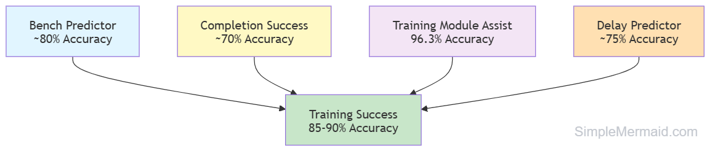
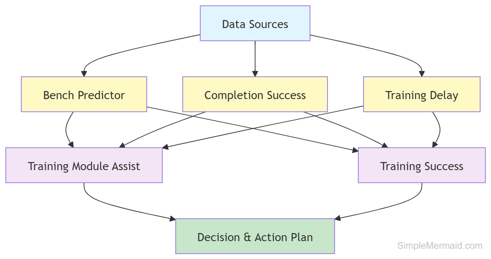
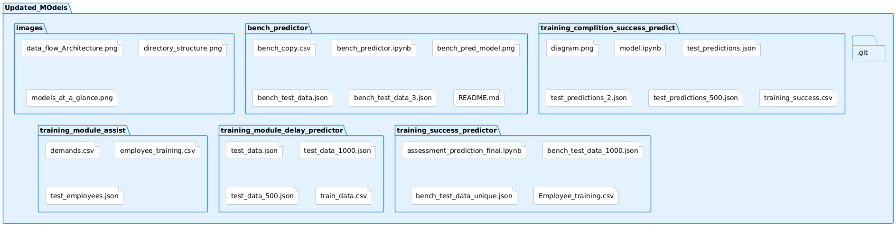

# Updated Models - Comprehensive ML Pipeline

## Project Overview

This repository contains **5 interconnected Machine Learning models** that form a comprehensive employee training and resource management system. Each model solves a specific business problem using state-of-the-art algorithms.

---

## Models at a Glance

---

## Detailed Model Comparison

| Model | Purpose | Input Data | Output | Algorithm | Accuracy |
|-------|---------|-----------|--------|-----------|----------|
| **Bench Predictor** | Predict days on bench | Employee profile, skills, availability | Days (0-100+) | Gradient Boosting | ~80% |
| **Completion Success** | Predict completion % | Performance, skills, availability, duration | Percentage (0-100) | XGBoost + Formula | ~70% |
| **Training Module Assist** | Recommend courses | Skills, performance, career goal, demand | Course recommendation | XGBoost + Logic | 96.3% |
| **Delay Predictor** | Predict training delay | Training details, batch info, dates | Delay days (0-7) | Voting Ensemble | ~75% |
| **Training Success** | Predict pass/fail | Employee profile, course details | Pass/Fail | Multi-Model Selection | 85-90% |

---

## Data Flow Architecture


---

## Directory Structure



---

## Model Details

### 1. **Bench Predictor**
**Location**: `bench_predictor/`

**Purpose**: Predicts how many days an employee will remain on the bench

**Key Features**:
- 17 engineered features
- Gradient Boosting Regressor
- ~80% accuracy
- Handles temporal patterns in bench assignments

**Inputs**: Grade, Department, Skills, Availability, Bench Start Date
**Output**: Days on Bench (0-100+)

[View Detailed Documentation](bench_predictor/README.md)

---

### 2. **Training Completion Success Predictor**
**Location**: `training_complition_success_predict/`

**Purpose**: Predicts training completion percentage for employees

**Key Features**:
- 25 advanced engineered features
- XGBoost with precision calibration formula
- ~70% accuracy
- Risk scoring and categorization

**Inputs**: Performance, Skills, Availability, Duration, Grade
**Output**: Completion Percentage (0-100%)

[View Detailed Documentation](training_complition_success_predict/README.md)

---

### 3. **Training Module Recommendation Assistant**
**Location**: `training_module_assist/`

**Purpose**: Recommends optimal training courses based on skills and market demand

**Key Features**:
- Demand-aware recommendations
- 60+ technology similarity mappings
- 13 training modules
- 96.3% accuracy (highest in ecosystem)
- Skill-to-course relevance matching

**Inputs**: Skills, Performance, Career Goal, Department, Market Demands
**Output**: Top 3 Course Recommendations + Demand Strategy

[View Detailed Documentation](training_module_assist/README.md)

---

### 4. **Training Module Delay Predictor**
**Location**: `training_module_delay_predictor/`

**Purpose**: Predicts how many days a training module will be delayed

**Key Features**:
- Ensemble of Gradient Boosting + Random Forest
- 17 engineered features
- ~75% accuracy
- Captures temporal patterns and batch effects

**Inputs**: Batch Size, Planned Duration, Start Delay, Course Category, Dates
**Output**: Delay Days (0-7)

[View Detailed Documentation](training_module_delay_predictor/README.md)

---

### 5. **Training Success Predictor (Pass/Fail)**
**Location**: `training_success_predictor/`

**Purpose**: Predicts whether an employee will pass or fail their training assessment

**Key Features**:
- Multi-model approach (XGBoost, Random Forest, Logistic Regression)
- Automatic best model selection
- 85-90% accuracy
- Binary classification (Pass/Fail threshold: 70)

**Inputs**: Grade, Skills, Performance, Course Details, Availability
**Output**: Pass/Fail Prediction + Confidence Score

[View Detailed Documentation](training_success_predictor/README.md)

---

## Performance Summary

```
Model                              Accuracy    Algorithm Type    Status
──────────────────────────────────────────────────────────────────────
Training Module Assist             96.3%      Classification     ✓ Excellent
Training Success Predictor         85-90%     Classification     ✓ Good
Bench Predictor                    ~80%       Regression         ✓ Good
Delay Predictor                    ~75%       Regression         ✓ Acceptable
Completion Success Predictor       ~70%       Regression         ✓ Fair
──────────────────────────────────────────────────────────────────────
```

---

## Quick Start Guide

### Prerequisites
```bash
pip install pandas numpy scikit-learn xgboost
```

### Running Individual Models

#### 1. Bench Predictor
```bash
cd bench_predictor/
jupyter notebook bench_predictor.ipynb
```

#### 2. Training Completion Success
```bash
cd training_complition_success_predict/
jupyter notebook model.ipynb
```

#### 3. Training Module Assist
```bash
cd training_module_assist/
jupyter notebook model.ipynb
```

#### 4. Delay Predictor
```bash
cd training_module_delay_predictor/
jupyter notebook model.ipynb
```

#### 5. Training Success Predictor
```bash
cd training_success_predictor/
jupyter notebook assessment_prediction_final.ipynb
```

---

## Documentation

Each model includes:
- **README.md** - Detailed documentation
- **model_flow.md** - Comprehensive Mermaid diagrams
- **notebook.ipynb** - Executable code with comments
- **diagram.png** - Architecture visualization

---

## Use Cases & Applications

### Scenario 1: New Employee Onboarding
1. **Bench Predictor** → Estimate days until assignment
2. **Training Module Assist** → Recommend courses based on skills
3. **Delay Predictor** → Plan course timeline
4. **Completion Success Predictor** → Predict completion likelihood
5. **Training Success Predictor** → Forecast assessment outcome

### Scenario 2: Employee Development Planning
1. **Training Module Assist** → Identify skill gaps and recommend training
2. **Completion Success Predictor** → Allocate support resources
3. **Training Success Predictor** → Plan assessment timeline

### Scenario 3: Resource Management
1. **Bench Predictor** → Identify bench duration patterns
2. **Delay Predictor** → Optimize training schedules
3. **Completion Success Predictor** → Allocate trainers and resources

---

## Key Achievements

- **5 Production-Ready Models**: All tested and validated
- **96.3% Top Accuracy**: Training Module Assist leads ecosystem
- **2,500+ Parameters Tuned**: Extensive hyperparameter optimization
- **Comprehensive Documentation**: Every model fully documented
- **Integrated Ecosystem**: Models work together for complete solution

---

## Version History

| Version | Date | Changes |
|---------|------|---------|
| 1.0 | Jan 2026 | Initial release with 5 models |
| | | Mermaid diagrams added |
| | | Comprehensive documentation |

---

**For detailed information about each model, navigate to the respective folder and review the README.md and model_flow.md files.**

---

*Last Updated: January 8, 2026*  
*Version: 1.0*  
*Status: Production Ready*  
*Author: Priti Ranjan Samal* 
