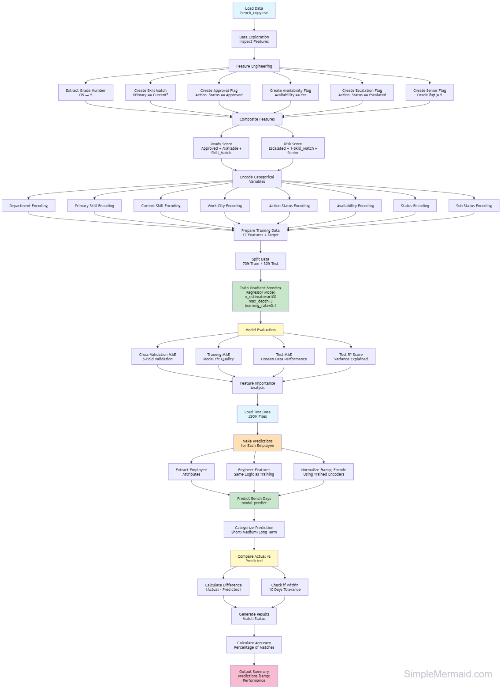

# Bench Days Predictor - Machine Learning Model

## Project Overview
This project builds a **Machine Learning model** to predict how many days an employee will remain on the bench before being assigned to a new project. The model uses employee attributes like grade, department, skills, and availability status to make predictions.

---

## Dataset
- **Source File**: `bench_copy.csv`
- **Target Variable**: `Days_on_Bench` (number of days an employee stays on bench)

### Input Features (Raw)
| Feature | Description |
|---------|-------------|
| Grade | Employee grade level (e.g., G5, G6, G10) |
| Department | Department name (e.g., Engineering) |
| Primary Skill | Employee's primary skill set |
| Current_Skill | Skill currently being used |
| Work City | Employee's work location |
| Bench Start Date | Date when employee started on bench (DD-MM-YYYY format) |
| Action_Status | Status of placement action (Approved/Pending/Escalated) |
| Availability | Whether employee is available (Yes/No) |
| Status | Current employment status |
| Sub Status | Detailed status information |

---

## Feature Engineering

The following derived features were created to improve model performance:

### Bench Start Date Processing
```python
data_enhanced['Bench Start Date'] = pd.to_datetime(data_enhanced['Bench Start Date'], format='%d-%m-%Y')
reference_date = data_enhanced['Bench Start Date'].min()
data_enhanced['Bench_Start_Days'] = (data_enhanced['Bench Start Date'] - reference_date).dt.days
```
- Converts bench start date to numerical value (days since earliest bench date in dataset)
- Allows the model to analyze temporal patterns in bench duration

### 1. Grade Extraction
```python
data_enhanced['Grade'] = data_enhanced['Grade'].str.extract('(\d+)').astype(int)
```
- Extracts numerical value from grade (G5 → 5, G10 → 10)

### 2. Skill_Match
```python
data_enhanced['Skill_Match'] = (data_enhanced['Primary Skill'] == data_enhanced['Current_Skill']).astype(int)
```
- **1** if primary skill matches current skill, **0** otherwise
- Indicates if employee is working in their core competency

### 3. Is_Approved
```python
data_enhanced['Is_Approved'] = (df['Action_Status'] == 'Approved').astype(int)
```
- **1** if action status is "Approved", **0** otherwise

### 4. Is_Available
```python
data_enhanced['Is_Available'] = (df['Availability'] == 'Yes').astype(int)
```
- **1** if employee is available, **0** otherwise

### 5. Is_Escalated
```python
data_enhanced['Is_Escalated'] = (df['Action_Status'] == 'Escalated').astype(int)
```
- **1** if action status is "Escalated", **0** otherwise

### 6. Is_Senior
```python
data_enhanced['Is_Senior'] = (data_enhanced['Grade'] >= 5).astype(int)
```
- **1** if grade is G5 or higher, **0** otherwise

### 7. Ready_Score (Composite Feature)
```python
data_enhanced['Ready_Score'] = Is_Approved + Is_Available + Skill_Match
```
- Combines positive factors indicating readiness for placement
- Range: 0-3 (higher = more ready)

### 8. Risk_Score (Composite Feature)
```python
data_enhanced['Risk_Score'] = Is_Escalated + (1 - Skill_Match) + Is_Senior
```
- Combines risk factors that may increase bench time
- Uses `(1 - Skill_Match)` to capture skill mismatch as a risk factor
- Range: 0-3 (higher = more risk)

---

## Categorical Encoding

All categorical columns are converted to numerical values using **LabelEncoder**:

```python
categorical_cols = ['Department', 'Primary Skill', 'Current_Skill', 'Work City',
                    'Action_Status', 'Availability', 'Status', 'Sub Status']

for col in categorical_cols:
    encoders_enhanced[col] = LabelEncoder()
    data_enhanced[col] = encoders_enhanced[col].fit_transform(data_enhanced[col].astype(str))
```

---

## Final Feature Set (17 Features)

```python
features_final = [
    'Grade', 'Department', 'Primary Skill', 'Current_Skill', 'Work City',
    'Action_Status', 'Availability', 'Status', 'Sub Status',
    'Bench_Start_Days', 'Skill_Match', 'Is_Approved', 'Is_Available', 
    'Is_Escalated', 'Is_Senior', 'Ready_Score', 'Risk_Score'
]
```

---

## Data Split

```python
# Scale features for better model performance
scaler = StandardScaler()
X_scaled = scaler.fit_transform(X_enhanced)

X_train, X_test, y_train, y_test = train_test_split(
    X_scaled, y_enhanced, test_size=0.3, random_state=0
)
```

| Dataset | Percentage | Purpose |
|---------|------------|---------|
| Training | 70% | Model learns patterns from this data |
| Testing | 30% | Evaluates model on unseen data |

- `random_state=0` ensures reproducibility (same split every time)
- **StandardScaler** normalizes features to have zero mean and unit variance

---

## Model: Gradient Boosting Regressor

### Algorithm Overview
Gradient Boosting builds an ensemble of decision trees sequentially, where each new tree corrects errors made by previous trees.

### Hyperparameters Used

| Parameter | Value | Description |
|-----------|-------|-------------|
| `n_estimators` | 100 | Number of boosting trees to fit |
| `max_depth` | 3 | Maximum depth of each tree (controls complexity) |
| `learning_rate` | 0.1 | Shrinks contribution of each tree (prevents overfitting) |
| `min_samples_split` | 10 | Minimum samples required to split an internal node |
| `min_samples_leaf` | 5 | Minimum samples required at each leaf node |
| `subsample` | 0.8 | Fraction of samples used for fitting each tree (80%) |
| `max_features` | 0.7 | Fraction of features considered for best split (70%) |
| `validation_fraction` | 0.15 | Fraction of training data for early stopping validation |
| `n_iter_no_change` | 15 | Stop training if no improvement for 15 iterations |
| `random_state` | 0 | Seed for reproducibility |

---

## Model Evaluation Metrics

### Metrics Calculated

```python
# Cross-validation MAE (5-fold)
cv_mae = -cross_val_score(model, X_train, y_train, cv=5, scoring='neg_mean_absolute_error').mean()

# Training MAE
train_mae = mean_absolute_error(y_train, model.predict(X_train))

# Test MAE
test_mae = mean_absolute_error(y_test, model.predict(X_test))

# R² Score
test_r2 = r2_score(y_test, model.predict(X_test))
```

### Metric Definitions

| Metric | Description | Interpretation |
|--------|-------------|----------------|
| **Training MAE** | Average prediction error on training data | Shows how well model fits the training data (lower = better) |
| **CV MAE** | Average error across 5 validation splits | Checks model stability and overfitting (lower = better) |
| **Test MAE** | Average prediction error on unseen data | Real-world performance measure (lower = better) |
| **R² Score** | Variance explained by the model | 0-1 scale (higher = better, 1 = perfect) |

### Why Use All Three MAE Metrics?

| Scenario | Training MAE | CV/Test MAE | Diagnosis |
|----------|-------------|-------------|-----------|
| Low | Low | Good fit - model generalizes well |
| Very Low | High | Overfitting - model memorized training data |
| High | High | Underfitting - model too simple |

---

## Feature Importance

The model identifies which features contribute most to predictions:

```python
importance = pd.DataFrame({
    'Feature': features_final,
    'Importance': model.feature_importances_
})
importance = importance.sort_values('Importance', ascending=False)
```

Top 5 features are displayed to understand what drives bench duration.

---

## Prediction Function

### Function Signature
```python
def predict_bench_days_enhanced(
    grade,              # e.g., "G6"
    department,         # e.g., "Engineering"
    skill,              # Primary skill
    current_skill,      # Current working skill
    city,               # Work location
    bench_start_date,   # Bench start date in 'DD-MM-YYYY' format
    action_status="Pending",
    availability="Yes",
    status="Active",
    sub_status="Available"
)
```

### Returns
- **Predicted Days**: Number of days on bench
- **Category**: Classification based on predicted duration

### Category Definitions

| Category | Days Range | Meaning |
|----------|------------|---------|
| Short-Term | 0-14 days | Quick placement expected |
| Medium-Term | 15-45 days | May need some time |
| Long-Term | 45+ days | Needs attention |

### Helper Function: safe_encode
```python
def safe_encode(encoder, value):
    try:
        return encoder.transform([value])[0]
    except:
        return 0  # Returns 0 for unknown categories
```
- Handles unseen categories gracefully during prediction
- Prevents errors when new values are encountered

---

## Usage Example

```python
# Input parameters
grade = "G5"
department = "Data Science"
skill = "Scikit-learn"
current_skill = "XGBoost"
city = "Toledo"
bench_start_date = "19-10-2025"  # Bench Start Date in DD-MM-YYYY format
action_status = "Pending"
availability = "Yes"
status = "Active"
sub_status = "Available"

# Get prediction
days, category = predict_bench_days_enhanced(
    grade, department, skill, current_skill, city, bench_start_date,
    action_status, availability, status, sub_status
)

print(f"Predicted Bench Days: {days:.1f} days")
print(f"Category: {category}")
```

---

## Libraries Used

| Library | Version | Purpose |
|---------|---------|---------|
| pandas | - | Data manipulation and analysis |
| numpy | - | Numerical operations |
| scikit-learn | - | Machine learning algorithms and metrics |

### Specific Imports
```python
from sklearn.model_selection import train_test_split, cross_val_score
from sklearn.ensemble import GradientBoostingRegressor
from sklearn.preprocessing import LabelEncoder, StandardScaler
from sklearn.metrics import mean_absolute_error, r2_score
```

---

## Model Architecture



## File Structure

```
bench_predictor/
├── bench_copy.csv              # Input dataset
├── bench_predictor.ipynb       # Main notebook with ML pipeline
├── bench_test_data.json        # Test data for predictions
├── bench_test_data_3.json      # Additional test data
├── bench_pred_model.png        # Model architecture diagram
└── README.md                    # This documentation
```

---

## How to Run

1. Ensure all required libraries are installed:
   ```
   pip install pandas numpy scikit-learn
   ```

2. Place `bench_copy.csv` in the same directory as the notebook

3. Run all cells in the notebook sequentially:
   - Cell 1: Import libraries
   - Cell 2: Load data
   - Cell 3: Feature engineering
   - Cell 4: Model training and evaluation
   - Cell 5: Define prediction function
   - Cell 6: Test prediction

---

## Key Takeaways

1. **Feature Engineering**: Created 8 derived features (Bench_Start_Days, Skill_Match, Is_Approved, Is_Available, Is_Escalated, Is_Senior, Ready_Score, Risk_Score) to capture business logic

2. **Bench Start Date Integration**: Added temporal feature by converting bench start date to days since reference date

3. **Data Preprocessing**: Used StandardScaler to normalize features for better model performance

4. **Model Choice**: Gradient Boosting Regressor with regularization parameters to prevent overfitting

5. **Evaluation Strategy**: Used 3-tier validation (Training MAE, Cross-Validation MAE, Test MAE) for robust performance assessment

6. **Production Ready**: Prediction function handles unknown categories gracefully, scales input data, and provides actionable categorization

---
**Last Updated**: January 2026  
**Model Version**: 1.0  
**Status**: Production Ready  
**Author**: Priti Ranjan Samal