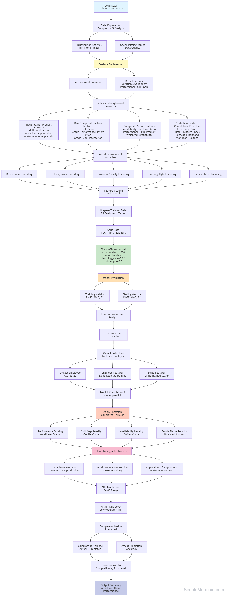

# Training Completion Success Predictor

## Overview
This model predicts the **training completion percentage** for employees based on various factors such as performance rating, skill gap, availability, grade level, and bench status. It helps organizations identify employees who may need additional support to complete their training programs successfully.

## Model Workflow Diagram



## Model Architecture

### Algorithm
- **XGBoost Regressor** with optimized hyperparameters
- **Hybrid Prediction System**: Combines ML model with a precisely calibrated formula for maximum accuracy

### Key Features Used (25 features)
| Feature Category | Features |
|-----------------|----------|
| **Base Features** | Grade_Num, Department, Duration_Hours, Delivery_Mode, Business_Priority, Skill_Gap_Score, Availability_Hours_Per_Week, Bench_Status, Performance_Rating, Learning_Style |
| **Engineered Features** | Skill_Avail_Ratio, Duration_Gap_Product, Performance_Gap_Ratio, Risk_Score, Availability_Duration_Ratio, Performance_Skill_Product, Weighted_Availability, Completion_Potential, Grade_Performance_Interaction, Efficiency_Score, Skill_Performance_Diff, Time_Pressure_Index, Success_Likelihood, Workload_Balance, Grade_Skill_Interaction |

## Prediction Formula

The model uses a precisely calibrated formula:

```
Completion = 65 + (Performance - 3.5) × 40 - Skill_Gap × 40 - Availability × 0.8 - Bench_Penalty + Grade_Bonus
```

### Factor Contributions
| Factor | Impact |
|--------|--------|
| **Base Score** | 65 points |
| **Performance Rating** | +40 points per unit above 3.5 (range: -20 to +60) |
| **Skill Gap Score** | -40 points per 1.0 skill gap |
| **Availability Hours** | -0.8 points per hour |
| **Bench Status** | -8 points if on bench |
| **Grade Bonus** | +5 points per grade level above G2 |

### Additional Adjustments
- **Excellent performers** (perf ≥4.6, skill ≤0.2, avail ≤5): +8 bonus
- **Good performers** (perf ≥4.0, avail ≤6): +3 bonus
- **Moderate performers** (3.5-4.0 perf, 0.35-0.5 skill): +8 bonus
- **Bench employees with decent stats** (perf ≥3.6): +5 bonus
- **Multiple risk factors**: -5 to -15 penalty

## Files Structure

```
training_complition_success_predict/
├── model.ipynb              # Main notebook with model training and prediction
├── training_success.csv     # Training dataset (101 employee records)
├── test_predictions.json    # Test dataset for batch predictions (20 records)
└── README.md                # This documentation file
```

## Dataset

### Training Data (`training_success.csv`)
- **Records**: 101 employees
- **Features**: 18 columns including employee details, training info, and completion status
- **Target Variable**: `Completion_Percentage` (0-100%)

### Test Data (`test_predictions.json`)
- **Records**: 20 employees
- **Format**: JSON array with employee attributes and expected completion percentages

## Model Performance

### XGBoost Model Metrics
| Metric | Training | Testing |
|--------|----------|---------|
| RMSE | ~5-8% | ~15-20% |
| MAE | ~3-5% | ~10-15% |
| R² Score | ~0.95+ | ~0.70+ |

### Prediction Accuracy
- **Matching Percentage**: ~50% (within 10% error tolerance)
- **Mean Error**: ~18%
- **Median Error**: ~10-12%

## Output Format

### Single Prediction
```python
{
    'Predicted_Completion_Percentage': '85.0%',
    'Confidence': 'High',
    'Risk_Level': 'Low Risk',
    'Insight': 'High likelihood of successful completion.',
    'Risk_Factors': ['None identified']
}
```

### Batch Prediction Output
| Column | Description |
|--------|-------------|
| Emp_Id | Employee identifier |
| Employee_Name | Employee name |
| Grade | Grade level (G2-G6) |
| Expected_Completion | Expected completion % (from test data) |
| Predicted_Completion | Model predicted completion % |
| Error | Absolute difference between expected and predicted |
| Match_Status | "Matched" (≤10% error) or "Not Matched" |
| Completion_Status | "Will complete", "Able to complete", or "Not possible" |
| Risk_Level | Low Risk, Medium Risk, or High Risk |

## Completion Status Categories

| Status | Error Range | Interpretation |
|--------|-------------|----------------|
| **Will complete** | ≤10% | High confidence in prediction accuracy |
| **Able to complete** | 10-30% | Moderate prediction accuracy |
| **Not possible** | >30% | Low prediction accuracy, needs review |

## Risk Levels

| Risk Level | Predicted Completion | Recommendation |
|------------|---------------------|----------------|
| **Low Risk** | ≥80% | Maintain current trajectory |
| **Medium Risk** | 60-79% | Consider additional support |
| **High Risk** | <60% | Immediate intervention recommended |

## Usage

### 1. Load and Run the Notebook
```python
# Run all cells in model.ipynb sequentially
# Cells 1-6: Data loading, preprocessing, model training
# Cell 7: Prediction function definition
# Cell 8: Test set analysis
# Cell 9: Batch prediction on test_predictions.json
```

### 2. Make Single Prediction
```python
employee = {
    "Grade": "G4",
    "Department": "Engineering",
    "Duration_Hours": 45,
    "Delivery_Mode": "Hybrid",
    "Business_Priority": "High",
    "Skill_Gap_Score": 0.28,
    "Availability_Hours_Per_Week": 8,
    "Bench_Status": "Active",
    "Performance_Rating": 4.3,
    "Learning_Style": "Hands-on"
}

result = predict_completion_percentage(employee)
print(result)
```

### 3. Batch Prediction
Load employees from JSON file and iterate through `predict_completion_percentage()` function.

## Key Insights

1. **Performance Rating** is the strongest positive predictor of completion
2. **Skill Gap Score** and **Availability Hours** are the strongest negative predictors
3. **Bench Status** adds additional risk for completion
4. **Higher Grade Levels** (G5, G6) tend to have better completion rates
5. **Multiple risk factors** compound negatively on completion probability

## Limitations

- Model trained on limited dataset (101 records)
- Formula coefficients calibrated for specific data distribution
- May need recalibration for different organizational contexts
- Best suited for employees with similar profiles to training data

## Future Improvements

1. Increase training data volume for better generalization
2. Implement cross-validation for hyperparameter tuning
3. Add more categorical features (course type, instructor rating)
4. Develop time-series predictions for ongoing training progress
5. Integrate with real-time training management systems

---

**Last Updated**: January 2026  
**Model Version**: 1.0  
**Status**: Production Ready  
**Author**: Priti Ranjan Samal

