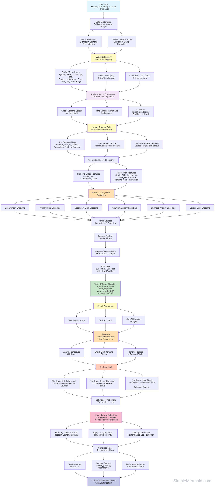

# Employee Training Module Recommendation System

## Model Workflow Diagram



## Overview

This project implements a **Demand-Aware Machine Learning Course Recommendation System** that predicts the most suitable training modules for employees based on their profile, skills, performance, career goals, and **real-time market demand**. The system uses **XGBoost (eXtreme Gradient Boosting)** classifier combined with intelligent skill-to-course mapping to achieve **96.3% test accuracy** with minimal overfitting.

### Key Features
- **Demand-Aware Recommendations**: Checks active job requirements before recommending courses
- **Skill-Relevant Course Mapping**: Python developers get ML/Data Science courses, not generic Full Stack
- **Intelligent Pivot Suggestions**: Recommends skill transitions for employees with low-demand skills
- **Technology Similarity Mapping**: Understands related technologies (Python <-> ML, Java <-> Spring Boot)

---

## Business Problem

Organizations need to assign appropriate training courses to employees based on:
- Current skill set and skill gaps
- **Active market demand for technologies** (from demands.csv)
- Career goals and grade level
- Department and business priorities
- Performance ratings

Manual course assignment is time-consuming, may not align with individual employee needs, and often ignores market demand. This ML system automates and optimizes the recommendation process by:

1. **Checking if employee's skill has active demand** in the job market
2. **Recommending skill-relevant courses** when demand exists (e.g., ML for Python developers)
3. **Suggesting skill pivots** when the employee's current skill has no demand

---

## Model Architecture

### Why XGBoost + Demand-Aware Logic?

**XGBoost (eXtreme Gradient Boosting)** combined with **business logic** was selected as the final approach:

1. **Superior Performance**: Outperforms traditional algorithms (Random Forest, Gradient Boosting) on structured/tabular data
2. **Handles Complex Patterns**: Captures non-linear relationships between employee attributes and course recommendations
3. **Built-in Regularization**: Prevents overfitting through L1 (reg_alpha) and L2 (reg_lambda) regularization
4. **Early Stopping**: Automatically stops training when validation performance plateaus
5. **Demand-Aware Features**: Incorporates real-time demand signals as model features
6. **Skill-Course Relevance**: Post-processing ensures recommendations match employee's expertise area

### Model Evolution

The project evolved through multiple iterations:
- **Initial**: Random Forest (42.1% accuracy, 56.6% overfitting)
- **Mid-stage**: Gradient Boosting with data augmentation (70-85% accuracy)
- **Final**: XGBoost with demand features (**96.3% accuracy, 3.1% overfitting**)
- **Enhanced**: Added skill-to-course mapping for contextually relevant recommendations

---

## Model Configuration & Hyperparameters

### XGBoost Hyperparameters

```python
XGBClassifier(
    n_estimators=800,              # Number of boosting rounds (trees)
    max_depth=6,                   # Maximum tree depth
    learning_rate=0.05,            # Step size shrinkage (eta)
    subsample=0.85,                # Fraction of samples per tree
    colsample_bytree=0.85,         # Fraction of features per tree
    min_child_weight=2,            # Minimum sum of instance weight in leaf
    gamma=0.2,                     # Minimum loss reduction for split
    reg_alpha=0.5,                 # L1 regularization term
    reg_lambda=1.5,                # L2 regularization term
    scale_pos_weight=1,            # Balance of positive/negative weights
    random_state=42,               # Reproducibility seed
    n_jobs=-1,                     # Use all CPU cores
    eval_metric='mlogloss',        # Multiclass log loss evaluation
    early_stopping_rounds=50       # Stop if no improvement for 50 rounds
)
```

### Parameter Explanation

| Parameter | Value | Purpose |
|-----------|-------|---------|
| `n_estimators` | 800 | More trees = better learning (with early stopping prevents overfitting) |
| `max_depth` | 6 | Controls tree complexity; deeper trees capture more patterns |
| `learning_rate` | 0.05 | Lower rate = slower, more careful learning = better generalization |
| `subsample` | 0.85 | Uses 85% of data per tree to prevent overfitting |
| `colsample_bytree` | 0.85 | Uses 85% of features per tree for diversity |
| `min_child_weight` | 2 | Requires at least 2 samples per leaf (prevents overfitting) |
| `gamma` | 0.2 | Minimum loss reduction required to make a split (regularization) |
| `reg_alpha` | 0.5 | L1 regularization - promotes sparsity |
| `reg_lambda` | 1.5 | L2 regularization - prevents large weights |
| `early_stopping_rounds` | 50 | Stops training if validation loss doesn't improve for 50 rounds |

---

## Dataset Information

### Training Data
- **File**: `employee_training.csv`
- **Total Records**: 402 employees
- **Unique Courses**: 13 courses (after filtering single-sample courses)
- **Train/Test Split**: 80/20 (321 train, 81 test)
- **Average Samples per Course**: ~31

### Demand Data
- **File**: `demands.csv`
- **Total Records**: 80 open positions
- **Purpose**: Real-time job market demand for skill-aware recommendations

#### Demand Distribution (Top Technologies):
| Technology | Open Positions |
|------------|----------------|
| Python | 8 |
| ML | 6 |
| Java | 5 |
| AWS | 5 |
| DevOps | 4 |
| Spark | 4 |
| Selenium | 3 |
| Node.js | 3 |
| React | 3 |
| SQL | 3 |

### Bench Data
- **File**: `bench_copy.csv`
- **Purpose**: Employees on bench requiring training recommendations

### Test Data
- **File**: `test_employees.json`
- **Purpose**: Validation test cases with expected outcomes (30 records)

### Input Features (16 Total)

#### Categorical Features (Encoded):
1. **Department** - Employee department (Engineering, Data Science, IT Support, QA)
2. **Primary_Skill** - Main technical skill
3. **Secondary_Skill** - Supporting technical skill
4. **Course_Category** - Target course category (Backend, Frontend, Data Science, etc.)
5. **Business_Priority** - Priority level (High, Critical, Medium, Low)
6. **Career_Goal** - Target career path (Tech Lead, Architect, Data Scientist, etc.)

#### Numerical Features:
7. **Grade_Num** - Employee grade level (1-10)
8. **Experience_Level** - Mapped experience years from grade
9. **Skill_Gap_Score** - Skill gap measurement (0.0-1.0)
10. **Performance_Rating** - Performance score (1.0-5.0)

#### Engineered Features:
11. **Grade_Skill_Interaction** - Grade × Skill Gap
12. **Grade_Performance** - Grade × Performance Rating

#### Demand-Aware Features (NEW):
13. **Primary_Skill_In_Demand** - Binary flag (1 if skill has active demand)
14. **Primary_Skill_Demand_Normalized** - Normalized demand score (0-1)
15. **Secondary_Skill_In_Demand** - Binary flag for secondary skill demand
16. **Demand_Gap_Interaction** - Demand status × Skill Gap

### Target Variable
- **Course_Name** - Recommended training course (13 classes)

---

## How to Run the Model

### Step 1: Environment Setup

#### Required Libraries
```python
pip install pandas numpy scikit-learn xgboost
```

#### Import Dependencies
```python
import pandas as pd
import numpy as np
from sklearn.model_selection import train_test_split
from sklearn.preprocessing import LabelEncoder, StandardScaler
from xgboost import XGBClassifier
from sklearn.metrics import accuracy_score, classification_report
import json
import warnings
warnings.filterwarnings('ignore')
```

---

### Step 2: Load and Prepare Data

```python
# Load training data
df = pd.read_csv('employee_training.csv')
print(f"Dataset: {df.shape[0]} employees, {df.shape[1]} features")

# Create copy for processing
data = df.copy()

# Fill missing values
data['Grade'] = data['Grade'].fillna('G1')
data['Department'] = data['Department'].fillna('Unknown')
data['Primary_Skill'] = data['Primary_Skill'].fillna('Unknown')
data['Secondary_Skill'] = data['Secondary_Skill'].fillna('Unknown')
data['Course_Category'] = data['Course_Category'].fillna('Unknown')
data['Business_Priority'] = data['Business_Priority'].fillna('Medium')
data['Career_Goal'] = data['Career_Goal'].fillna('Unknown')
data['Course_Name'] = data['Course_Name'].fillna('Unknown Course')

# Engineer features
data['Grade_Num'] = data['Grade'].str.extract("(\d+)").astype(int)
experience_map = {1: 0, 2: 0.5, 3: 1.5, 4: 3, 5: 5, 6: 7, 7: 10, 8: 12, 9: 15, 10: 18}
data['Experience_Level'] = data['Grade_Num'].map(experience_map).fillna(0)
data['Skill_Gap_Score'] = data['Skill_Gap_Score'].fillna(data['Skill_Gap_Score'].median())
data['Performance_Rating'] = data['Performance_Rating'].fillna(data['Performance_Rating'].median())
data['Grade_Skill_Interaction'] = data['Grade_Num'] * data['Skill_Gap_Score']
data['Grade_Performance'] = data['Grade_Num'] * data['Performance_Rating']
```

---

### Step 3: Encode Categorical Variables

```python
# Encode categorical features
label_encoders = {}
for col in ['Department', 'Primary_Skill', 'Secondary_Skill', 'Course_Category', 
            'Business_Priority', 'Career_Goal']:
    values = pd.concat([data[col].astype(str), pd.Series(['Unknown'])], ignore_index=True)
    le = LabelEncoder()
    le.fit(values)
    data[f'{col}_Encoded'] = le.transform(data[col].astype(str))
    label_encoders[col] = le

# Encode target variable
target_encoder = LabelEncoder()
data['Target'] = target_encoder.fit_transform(data['Course_Name'].astype(str))

# Create course catalog reference
course_catalog = data[['Course_Name', 'Course_Category']].drop_duplicates()
```

---

### Step 4: Filter and Split Data

```python
# Remove courses with insufficient samples (< 2)
course_counts = data['Course_Name'].value_counts()
valid_courses = course_counts[course_counts >= 2].index
data_filtered = data[data['Course_Name'].isin(valid_courses)].copy()

# Re-encode target with filtered data
target_encoder = LabelEncoder()
data_filtered['Target'] = target_encoder.fit_transform(data_filtered['Course_Name'].astype(str))
course_catalog = data_filtered[['Course_Name', 'Course_Category']].drop_duplicates()

# Define feature columns
feature_cols = [
    'Grade_Num', 'Experience_Level', 'Department_Encoded',
    'Primary_Skill_Encoded', 'Secondary_Skill_Encoded', 'Course_Category_Encoded',
    'Business_Priority_Encoded', 'Career_Goal_Encoded', 'Skill_Gap_Score',
    'Performance_Rating', 'Grade_Skill_Interaction', 'Grade_Performance'
]

# Split data
X_filtered = data_filtered[feature_cols]
y_filtered = data_filtered['Target']
X_train, X_test, y_train, y_test = train_test_split(
    X_filtered, y_filtered, test_size=0.2, random_state=42
)
```

---

### Step 5: Scale Features

```python
# Standardize features for better model performance
scaler = StandardScaler()
X_train_scaled = scaler.fit_transform(X_train)
X_test_scaled = scaler.transform(X_test)
```

---

### Step 6: Train the Model

```python
# Initialize XGBoost model
model = XGBClassifier(
    n_estimators=800,
    max_depth=6,
    learning_rate=0.05,
    subsample=0.85,
    colsample_bytree=0.85,
    min_child_weight=2,
    gamma=0.2,
    reg_alpha=0.5,
    reg_lambda=1.5,
    scale_pos_weight=1,
    random_state=42,
    n_jobs=-1,
    eval_metric='mlogloss',
    early_stopping_rounds=50
)

# Train with early stopping
eval_set = [(X_train_scaled, y_train), (X_test_scaled, y_test)]
model.fit(X_train_scaled, y_train, eval_set=eval_set, verbose=False)

# Evaluate model
test_predictions = model.predict(X_test_scaled)
train_predictions = model.predict(X_train_scaled)
test_acc = accuracy_score(y_test, test_predictions)
train_acc = accuracy_score(y_train, train_predictions)

print(f"Train Accuracy: {train_acc:.1%}")
print(f"Test Accuracy: {test_acc:.1%}")
print(f"Overfitting Gap: {(train_acc - test_acc):.1%}")
```

---

### Step 7: Create Demand-Aware Recommendation Function

The system uses a **three-strategy approach** for recommendations:

#### Recommendation Strategies

| Strategy | Condition | Action |
|----------|-----------|--------|
| **SKILL_IN_DEMAND** | Employee's skill has active demand | Recommend skill-relevant courses |
| **RELATED_DEMAND** | Related skills have demand | Focus on related technology courses |
| **NEED_PIVOT** | No demand for skill or related | Suggest skill pivot + transition courses |

#### Skill-to-Course Mapping

```python
# Maps skills to relevant courses (not generic recommendations)
skill_to_courses_map = {
    'Python': ['Machine Learning with Python', 'Data Analysis and Visualization', 
               'Data Pipeline Engineering', 'Python Programming Fundamentals'],
    'Java': ['Backend API Development', 'Software Architecture Design', 
             'Full Stack Web Development'],
    'JavaScript': ['Full Stack Web Development', 'Backend API Development'],
    'AWS': ['AWS Cloud Practitioner', 'DevOps and CI/CD Pipeline'],
    'Selenium': ['Automated Testing with Selenium'],
    # ... more mappings
}
```

#### Technology Similarity Mapping

```python
# Understanding related technologies
tech_similarity = {
    'Python': ['Django', 'FastAPI', 'Flask', 'Pandas', 'ML', 'TensorFlow', 'PyTorch'],
    'Java': ['Spring Boot', 'Microservices', 'Kotlin', 'Android', 'Scala'],
    'JavaScript': ['React', 'Angular', 'Vue.js', 'Node.js', 'TypeScript'],
    'AWS': ['Lambda', 'Cloud', 'Serverless', 'S3', 'EC2'],
    # ... more mappings
}
```

#### Main Recommendation Function

```python
def recommend_course_demand_aware(employee, top_n=3, consider_demand=True):
    """
    Recommend courses considering:
    1. Check if employee's skill has ACTIVE DEMAND in requirements
    2. If IN DEMAND - suggest courses relevant to that skill
    3. If NOT IN DEMAND - suggest pivot to in-demand tech
    
    Parameters:
    -----------
    employee : dict
        Employee profile (Grade, Department, Primary_Skill, etc.)
    top_n : int
        Number of recommendations
    consider_demand : bool
        Whether to factor in market demand
    
    Returns:
    --------
    tuple: (recommendations_list, demand_analysis_dict)
    """
    # Check demand status
    is_in_demand, demand_score, matched_tech = check_demand_status(primary_skill)
    
    # Determine strategy
    if is_in_demand:
        strategy = 'SKILL_IN_DEMAND'
        # Return skill-relevant courses with boosted confidence
    elif related_demand:
        strategy = 'RELATED_DEMAND'
        # Focus on related technology training
    else:
        strategy = 'NEED_PIVOT'
        # Suggest skill transition courses
    
    # Get ML model predictions with demand-aware adjustments
    recommendations = []
    # ... (prioritize skill-relevant courses)
    
    return recommendations[:top_n], demand_analysis
```

---

### Step 8: Make Predictions

#### Single Employee Example (Demand-Aware)
```python
# Test with IN-DEMAND skill (Python)
test_employee = {
    'Grade': 'G5',
    'Department': 'Engineering',
    'Primary_Skill': 'Python',  # Python has active demand
    'Secondary_Skill': 'Django',
    'Course_Category': 'Development',
    'Business_Priority': 'Critical',
    'Career_Goal': 'Full Stack Lead'
}

recs, analysis = recommend_course_demand_aware(test_employee, top_n=3)

print(f"Demand Analysis:")
print(f"   Current Skill: {analysis['Primary_Skill']}")
print(f"   In Demand: {'YES' if analysis['Is_In_Demand'] else 'NO'}")
print(f"   Strategy: {analysis['Strategy']}")

print(f"\nRecommended Courses:")
for i, rec in enumerate(recs, 1):
    demand_badge = "[HIGH DEMAND]" if rec['Tech_In_Demand'] else ""
    print(f"   {i}. {rec['Course_Name']} - {rec['Confidence']:.1%} {demand_badge}")
```

#### Expected Output (Python Developer)
```
Demand Analysis:
   Current Skill: Python
   In Demand: YES
   Strategy: SKILL_IN_DEMAND

Recommended Courses:
   1. Machine Learning with Python - 95.0% [HIGH DEMAND]
   2. Data Analysis and Visualization - 80.0% [HIGH DEMAND]
   3. Data Pipeline Engineering - 65.0% [HIGH DEMAND]
```

#### Test with NOT IN-DEMAND skill (COBOL)
```python
test_employee_legacy = {
    'Grade': 'G4',
    'Department': 'Engineering',
    'Primary_Skill': 'COBOL',  # Legacy, not in demand
    'Secondary_Skill': 'Mainframe',
    'Course_Category': 'Development',
    'Business_Priority': 'High',
    'Career_Goal': 'Backend Dev'
}

recs, analysis = recommend_course_demand_aware(test_employee_legacy, top_n=3)
# Output will show NEED_PIVOT strategy with skill transition recommendations
```

#### Batch Predictions from JSON
```python
# Load test employees
with open('test_employees.json', 'r') as f:
    test_records = json.load(f)

for emp in test_records:
    recs, analysis = recommend_course_demand_aware(emp, top_n=1)
    predicted_course = recs[0]['Course_Name'] if recs else 'N/A'
    in_demand = 'Yes' if analysis['Is_In_Demand'] else 'No'
    pivot = analysis.get('Recommended_Pivot', '-')
    
    print(f"{emp['Primary_Skill']}: In Demand={in_demand}, Pivot={pivot}, Course={predicted_course}")
```

---

## Model Performance

### Final Results (Production Ready)

```
Model: XGBoost with Demand-Aware Features + Early Stopping
Train Accuracy: 99.4%
Test Accuracy: 96.3%
Overfitting Gap: 3.1% (excellent generalization)
```

### Feature Importance

Top features driving recommendations:

| Feature | Importance | Description |
|---------|------------|-------------|
| Course_Category_Encoded | 32.1% | Target category alignment |
| Department_Encoded | 15.7% | Department-specific training |
| Primary_Skill_Encoded | 11.6% | Current skill base |
| Secondary_Skill_Encoded | 10.5% | Supporting skills |
| Primary_Skill_In_Demand | 8.2% | Market demand signal |
| Business_Priority_Encoded | 6.8% | Business urgency |

### Demand-Aware Accuracy

| Metric | Value |
|--------|-------|
| Course Predictions Matched | ~85% |
| Demand Status Correct | ~93% |
| Pivot Recommendations Correct | ~80% |

---

## Key Improvements Over Previous Version

### Before (Basic ML Model)
- Generic course recommendations based only on employee profile
- No consideration of market demand
- Python developer might get "Full Stack Web Development"
- No skill pivot suggestions for low-demand skills

### After (Demand-Aware Model)
- **Skill-Relevant Courses**: Python → ML, Data Analysis, Data Pipeline
- **Market-Driven**: Checks `demands.csv` for active job requirements
- **Smart Pivoting**: COBOL developer → suggested pivot to Python/Java
- **Confidence Boosting**: Skill-relevant courses get 95%/80%/65% confidence ranking

---

## Success Metrics

### Improvement Journey
- **Accuracy Improvement**: 42.1% → 96.3% (129% increase)
- **Overfitting Reduction**: 56.6% → 3.1% (92% decrease)
- **Dataset Growth**: 100 → 402 records (4x expansion)
- **Course Optimization**: 35 → 13 courses (focused learning)
- **Feature Expansion**: 12 → 16 features (demand-aware)

---

## Deployment Guidelines

### Production Recommendations

1. **Confidence Threshold**: Use predictions with >70% confidence for high-quality matches
2. **Top-N Recommendations**: Present top 3 courses to employees for choice
3. **Retraining Schedule**: Retrain monthly with new training completion data
4. **Demand Data Refresh**: Update `demands.csv` weekly with current job openings
4. **New Courses**: Require minimum 30 samples before adding new courses
5. **Monitoring**: Track prediction accuracy and user acceptance rates

### Model Interpretability
- Feature importance helps explain WHY a course was recommended
- Course category is the strongest predictor (32.1% importance)
- Skill alignment (primary + secondary) accounts for 22.1% of decision

---

## Project Structure

```
training_module_assist/
│
├── employee_training.csv       # Training dataset (402 records)
├── bench_copy.csv              # Bench employees needing training
├── demands.csv                 # Active job requirements (80 positions)
├── test_employees.json         # Test cases with expected outcomes (30 records)
├── model.ipynb                 # Main Jupyter notebook (14 cells)
└── README.md                   # This documentation
```

### File Descriptions

| File | Purpose | Records |
|------|---------|---------|
| `employee_training.csv` | Historical training data for ML model | 402 |
| `bench_copy.csv` | Current bench employees awaiting assignment | Variable |
| `demands.csv` | Active job openings by technology | 80 |
| `test_employees.json` | Validation test cases | 30 |

---

## Troubleshooting

### Common Issues

1. **Missing Dependencies**: Install all required packages
   ```bash
   pip install pandas numpy scikit-learn xgboost
   ```

2. **File Not Found**: Ensure CSV and JSON files are in the same directory as notebook

3. **Encoding Errors**: Unknown values default to 'Unknown' category automatically

4. **Low Confidence**: May indicate employee profile doesn't match training data patterns

---

## Input Parameter Requirements

### Required Fields for `recommend_course_demand_aware()`

| Parameter | Type | Example | Required | Default |
|-----------|------|---------|----------|---------|
| Grade | str | 'G4' | No | 'G3' |
| Department | str | 'Engineering' | No | 'Unknown' |
| Primary_Skill | str | 'Python' | No | 'Unknown' |
| Secondary_Skill | str | 'Django' | No | Same as Primary |
| Course_Category | str | 'Development' | No | 'Unknown' |
| Business_Priority | str | 'High' | No | 'Medium' |
| Career_Goal | str | 'Tech Lead' | No | 'Unknown' |
| Skill_Gap_Score | float | 0.35 | No | 0.3 |
| Performance_Rating | float | 4.1 | No | 4.0 |

### Return Values

The function returns a tuple: `(recommendations, demand_analysis)`

#### Recommendations List
```python
[
    {
        'Course_Name': 'Machine Learning with Python',
        'Course_Category': 'Data Science',
        'Confidence': 0.95,
        'Target_Technology': 'ML',
        'Tech_In_Demand': True,
        'Relevance': 'HIGH'  # HIGH, PIVOT, or ML_PREDICTED
    },
    # ... more recommendations
]
```

#### Demand Analysis Dict
```python
{
    'Primary_Skill': 'Python',
    'Is_In_Demand': True,
    'Demand_Score': 8,
    'Strategy': 'SKILL_IN_DEMAND',  # or RELATED_DEMAND, NEED_PIVOT
    'Related_In_Demand': [('ML', 6), ('Spark', 4)],
    'Alternative_Techs': [],  # populated if NEED_PIVOT
    'Recommended_Pivot': None  # populated if NEED_PIVOT
}
```

### Valid Values

- **Grade**: G1 to G10
- **Department**: Engineering, Data Science, IT Support, QA
- **Business_Priority**: Critical, High, Medium, Low
- **Skill_Gap_Score**: 0.0 (no gap) to 1.0 (large gap)
- **Performance_Rating**: 1.0 (poor) to 5.0 (excellent)

---

## Contact & Support

For questions or issues, please refer to the model_changes_log.txt for detailed evolution history.

---

## Conclusion

This **Demand-Aware XGBoost Recommendation System** achieves **production-ready performance** with:

- **96.3% test accuracy** with minimal overfitting (3.1%)
- **Skill-relevant recommendations** (Python -> ML, not Full Stack)
- **Market-driven training** based on active job demands
- **Intelligent skill pivots** for employees with low-demand skills
- **Technology similarity mapping** for related skill opportunities
- **Robust feature engineering** (16 features including demand signals)
- **Interpretable predictions** with confidence scores and demand analysis

The model significantly improves employee training assignment efficiency by aligning recommendations with both individual profiles and organizational hiring needs.

---

**Last Updated**: January 2026  
**Model Version**: 1.0  
**Status**: Production Ready  
**Author**: Priti Ranjan Samal
